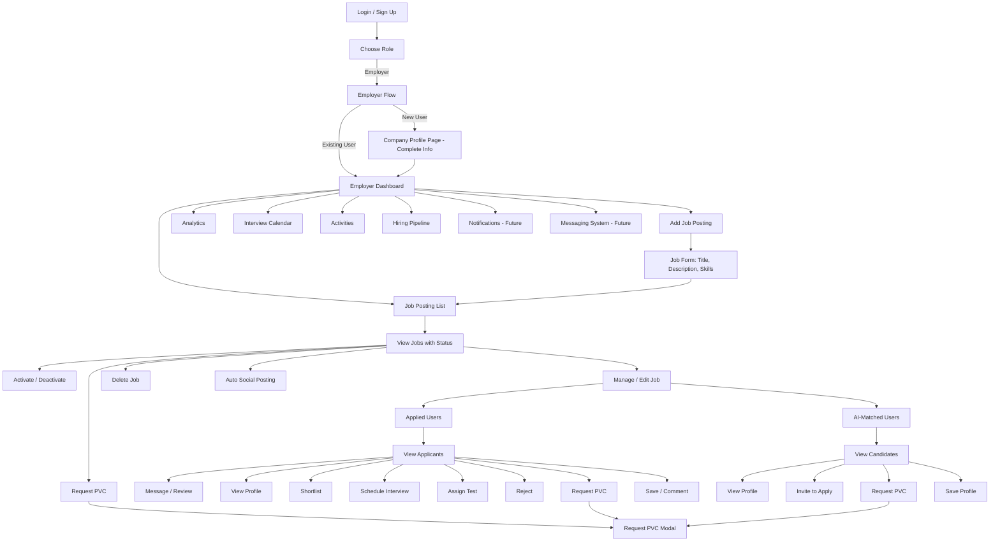

```mermaid
graph TD
    A["Login / Sign Up"] --> B["Choose Role"]
    B -->|Employer| C["Employer Flow"]

    C -->|New User| D["Company Profile Page - Complete Info"]
    C -->|Existing User| E["Employer Dashboard"]
    D --> E

    E --> F["Add Job Posting"]
    E --> G["Job Posting List"]
    E --> H["Analytics"]
    E --> I["Interview Calendar"]
    E --> J["Activities"]
    E --> K["Hiring Pipeline"]
    E --> L["Notifications - Future"]
    E --> M["Messaging System - Future"]

    F --> N["Job Form: Title, Description, Skills"]
    N --> G

    G --> O["View Jobs with Status"]
    O --> P["Activate / Deactivate"]
    O --> Q["Request PVC"]
    O --> R["Manage / Edit Job"]
    O --> S["Delete Job"]
    O --> T["Auto Social Posting"]

    %% Under Manage/Edit Job
    R --> U["Applied Users"]
    R --> V["AI-Matched Users"]

    %% Applied Users
    U --> W["View Applicants"]
    W --> X["Message / Review"]
    W --> Y["View Profile"]
    W --> Z["Shortlist"]
    W --> AA["Schedule Interview"]
    W --> AB["Assign Test"]
    W --> AC["Reject"]
    W --> AD["Request PVC"]
    W --> AE["Save / Comment"]

    %% AI-Matched Users
    V --> AF["View Candidates"]
    AF --> AG["View Profile"]
    AF --> AH["Invite to Apply"]
    AF --> AI["Request PVC"]
    AF --> AJ["Save Profile"]

    Q --> AK["Request PVC Modal"]
    AD --> AK
    AI --> AK
```
