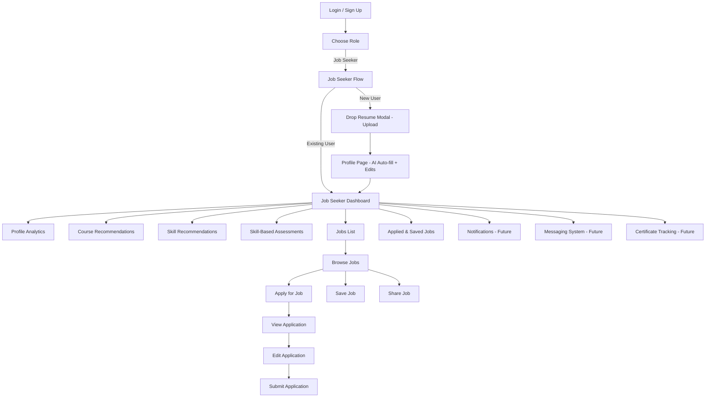

```mermaid
graph TD
A["Login / Sign Up"] --> B["Choose Role"]
B -->|Job Seeker| C["Job Seeker Flow"]

    C -->|New User| D["Drop Resume Modal - Upload"]
    D --> E["Profile Page - AI Auto-fill + Edits"]
    C -->|Existing User| F["Job Seeker Dashboard"]
    E --> F

    F --> G["Profile Analytics"]
    F --> H["Course Recommendations"]
    F --> I["Skill Recommendations"]
    F --> J["Skill-Based Assessments"]
    F --> K["Jobs List"]
    F --> L["Applied & Saved Jobs"]
    F --> M["Notifications - Future"]
    F --> N["Messaging System - Future"]
    F --> O["Certificate Tracking - Future"]

    K --> P["Browse Jobs"]
    P --> Q["Apply for Job"]
    P --> R["Save Job"]
    P --> S["Share Job"]

    Q --> T["View Application"]
    T --> U["Edit Application"]
    U --> V["Submit Application"]
```
