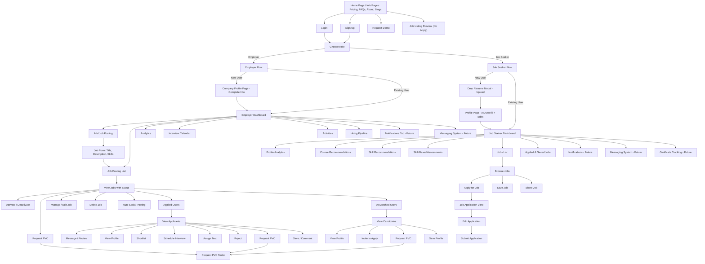

```mermaid
graph TD
    %% Common Entry Points
    A["Home Page / Info Pages: Pricing, FAQs, About, Blogs"]
    A --> B[Login]
    A --> C[Sign Up]
    A --> D["Request Demo"]
    A --> E["Job Listing Preview (No Apply)"]

    %% Role Selection
    B --> F["Choose Role"]
    C --> F
    F -->|Employer| G["Employer Flow"]
    F -->|Job Seeker| H["Job Seeker Flow"]

    %% Employer Flow
    G -->|New User| I["Company Profile Page - Complete Info"]
    G -->|Existing User| J["Employer Dashboard"]
    I --> J

    J --> K["Add Job Posting"]
    J --> L["Job Posting List"]
    J --> M[Analytics]
    J --> N["Interview Calendar"]
    J --> O[Activities]
    J --> P["Hiring Pipeline"]
    J --> Q["Notifications Tab - Future"]
    J --> R["Messaging System - Future"]

    K --> S["Job Form: Title, Description, Skills"]
    S --> L

    L --> T["View Jobs with Status"]
    T --> U["Activate / Deactivate"]
    T --> V["Request PVC"]
    T --> W["Manage / Edit Job"]
    T --> X["Delete Job"]
    T --> Y["Auto Social Posting"]
    T --> Z["Applied Users"]
    T --> AA["AI-Matched Users"]

    %% Applied Users
    Z --> AB["View Applicants"]
    AB --> AC["Message / Review"]
    AB --> AD["View Profile"]
    AB --> AE[Shortlist]
    AB --> AF["Schedule Interview"]
    AB --> AG["Assign Test"]
    AB --> AH[Reject]
    AB --> AI["Request PVC"]
    AB --> AJ["Save / Comment"]

    %% AI-Matched Users
    AA --> AK["View Candidates"]
    AK --> AL["View Profile"]
    AK --> AM["Invite to Apply"]
    AK --> AN["Request PVC"]
    AK --> AO["Save Profile"]

    V --> AP["Request PVC Modal"]
    AI --> AP
    AN --> AP

    %% Job Seeker Flow
    H -->|New User| AQ["Drop Resume Modal - Upload"]
    AQ --> AR["Profile Page - AI Auto-fill + Edits"]
    H -->|Existing User| AS["Job Seeker Dashboard"]
    AR --> AS

    AS --> AT["Profile Analytics"]
    AS --> AU["Course Recommendations"]
    AS --> AV["Skill Recommendations"]
    AS --> AW["Skill-Based Assessments"]
    AS --> AX["Jobs List"]
    AS --> AY["Applied & Saved Jobs"]
    AS --> AZ["Notifications - Future"]
    AS --> BA["Messaging System - Future"]
    AS --> BB["Certificate Tracking - Future"]

    AX --> BC["Browse Jobs"]
    BC --> BD["Apply for Job"]
    BC --> BE["Save Job"]
    BC --> BF["Share Job"]

    BD --> BG["Job Application View"]
    BG --> BH["Edit Application"]
    BH --> BI["Submit Application"]

```
